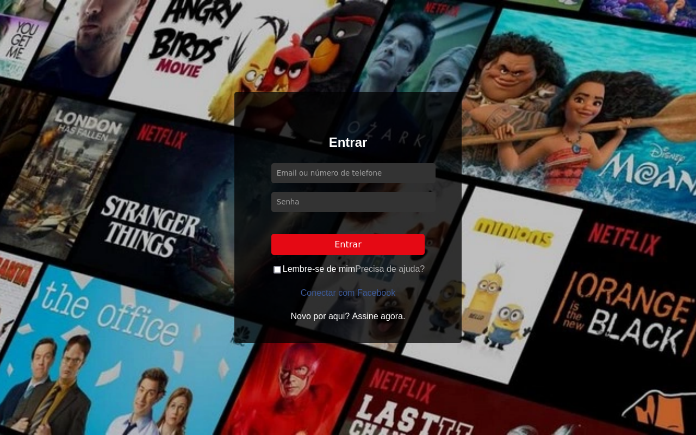

<h1>Login Page in React</h1>

<h2>Descrição do Projeto</h2>

Este projeto é uma página de login em React que simula a interface de login da Netflix. Ele foi desenvolvido para demonstrar habilidades em React, CSS e estruturação de projetos. O projeto inclui uma interface de usuário estilizada, com suporte a imagem de fundo e funcionalidade de formulário de login.

<h2>Estrutura do Projeto</h2>
<pre>
login-page/
├── public/
│   ├── index.html
├── src/
│   ├── components/
│   │   ├── Login.jsx
│   │   ├── Login.css
│   ├── App.js
│   ├── index.js
├── package.json
</pre>

<h2>Instalação</h2>
<ol>
    <li>Clone o repositório:
        <pre><code>git clone https://github.com/sucloudflare/delivery.git</code></pre>
    </li>
    <li>Navegue até o diretório do projeto:
        <pre><code>cd delivery</code></pre>
    </li>
    <li>Instale as dependências:
        <pre><code>npm install</code></pre>
    </li>
</ol>

<h2>Uso</h2>

Para iniciar o projeto, execute o seguinte comando:

<pre><code>npm start</code></pre>

Isso iniciará o servidor de desenvolvimento e abrirá a aplicação no navegador padrão. A página de login deve ser exibida.

<h2>Estrutura e Explicação do Código</h2>

<h3>public/index.html</h3>

O ponto de entrada HTML para o aplicativo React. Ele contém um div com id <code>root</code> onde o aplicativo React será montado.

<h3>src/index.js</h3>

Arquivo principal que monta o componente React no DOM.

<pre><code>import React from 'react';
import ReactDOM from 'react-dom';
import './index.css';
import App from './App';

ReactDOM.render(
  &lt;React.StrictMode&gt;
    &lt;App /&gt;
  &lt;/React.StrictMode&gt;,
  document.getElementById('root')
);
</code></pre>

<h3>src/App.js</h3>

Componente principal do aplicativo que renderiza o componente de login.

<pre><code>import React from 'react';
import Login from './components/Login';

function App() {
  return (
    &lt;div className="App"&gt;
      &lt;Login /&gt;
    &lt;/div&gt;
  );
}

export default App;
</code></pre>

<h3>src/components/Login.jsx</h3>

Componente de login que contém a estrutura do formulário de login e os elementos da interface do usuário.

<pre><code>import React from 'react';
import './Login.css';

const Login = () => {
  return (
    &lt;div className="login-background"&gt;
      &lt;div className="login-container"&gt;
        &lt;h2&gt;Entrar&lt;/h2&gt;
        &lt;form&gt;
          &lt;div className="form-group"&gt;
            &lt;input type="text" placeholder="Email ou número de telefone" /&gt;
          &lt;/div&gt;
          &lt;div className="form-group"&gt;
            &lt;input type="password" placeholder="Senha" /&gt;
          &lt;/div&gt;
          &lt;button type="submit" className="login-button"&gt;Entrar&lt;/button&gt;
          &lt;div className="form-options"&gt;
            &lt;div&gt;
              &lt;input type="checkbox" id="rememberMe" /&gt;
              &lt;label htmlFor="rememberMe"&gt;Lembre-se de mim&lt;/label&gt;
            &lt;/div&gt;
            &lt;div&gt;
              &lt;a href="/"&gt;Precisa de ajuda?&lt;/a&gt;
            &lt;/div&gt;
          &lt;/div&gt;
        &lt;/form&gt;
        &lt;div className="facebook-login"&gt;
          &lt;a href="/"&gt;Conectar com Facebook&lt;/a&gt;
        &lt;/div&gt;
        &lt;div className="signup-now"&gt;
          &lt;span&gt;Novo por aqui? &lt;/span&gt;
          &lt;a href="/"&gt;Assine agora&lt;/a&gt;.
        &lt;/div&gt;
      &lt;/div&gt;
    &lt;/div&gt;
  );
};

export default Login;
</code></pre>

<h3>src/components/Login.css</h3>

Arquivo de estilo que contém as regras CSS para o componente de login, incluindo a imagem de fundo.

<pre><code>.login-background {
  background-image: url('https://assets.nflxext.com/ffe/siteui/vlv3/3b6e1e35-c8a7-48ff-b39b-25c5a01b23ee/7baf8e7d-3be0-471d-8f9b-90e177fc7ed7/BR-pt-20210503-popsignuptwoweeks-perspective_alpha_website_large.jpg');
  background-size: cover;
  background-position: center;
  background-repeat: no-repeat;
  height: 100vh;
  display: flex;
  justify-content: center;
  align-items: center;
}

.login-container {
  background: rgba(0, 0, 0, 0.75);
  padding: 60px 68px 40px;
  border-radius: 5px;
  color: white;
  max-width: 450px;
  width: 100%;
  text-align: center;
}

.login-container h2 {
  margin-bottom: 24px;
}

.form-group {
  margin-bottom: 16px;
}

.form-group input {
  width: 100%;
  padding: 10px;
  border: none;
  border-radius: 5px;
  background: #333;
  color: white;
}

.login-button {
  width: 100%;
  padding: 10px;
  border: none;
  border-radius: 5px;
  background: #e50914;
  color: white;
  font-size: 16px;
  cursor: pointer;
  margin-top: 24px;
}

.form-options {
  display: flex;
  justify-content: space-between;
  margin-top: 16px;
}

.form-options a {
  color: #b3b3b3;
  text-decoration: none;
}

.facebook-login {
  margin-top: 24px;
}

.facebook-login a {
  color: #3b5998;
  text-decoration: none;
}

.signup-now {
  margin-top: 24px;
}

.signup-now a {
  color: white;
  text-decoration: none;
}
</code></pre>

<h2>Contribuição</h2>

Se você quiser contribuir para este projeto, por favor, siga estas etapas:

<ol>
    <li>Faça um fork do repositório.</li>
    <li>Crie uma nova branch para suas alterações:
        <pre><code>git checkout -b feature/nova-funcionalidade</code></pre>
    </li>
    <li>Faça suas alterações e commit:
        <pre><code>git commit -am 'Adiciona nova funcionalidade'</code></pre>
    </li>
    <li>Envie para o seu fork:
        <pre><code>git push origin feature/nova-funcionalidade</code></pre>
    </li>
    <li>Envie um pull request para revisão.</li>
</ol>

<h2>Licença</h2>

Este projeto está licenciado sob a Licença MIT. Veja o arquivo <a href="LICENSE">LICENSE</a> para mais detalhes.

